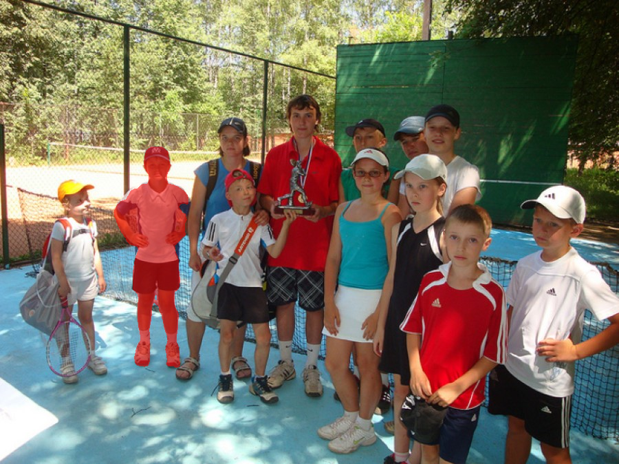
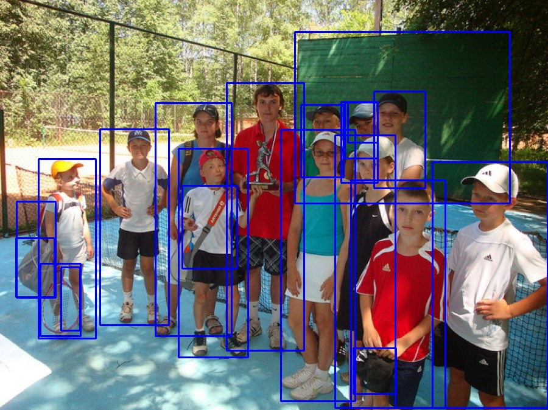
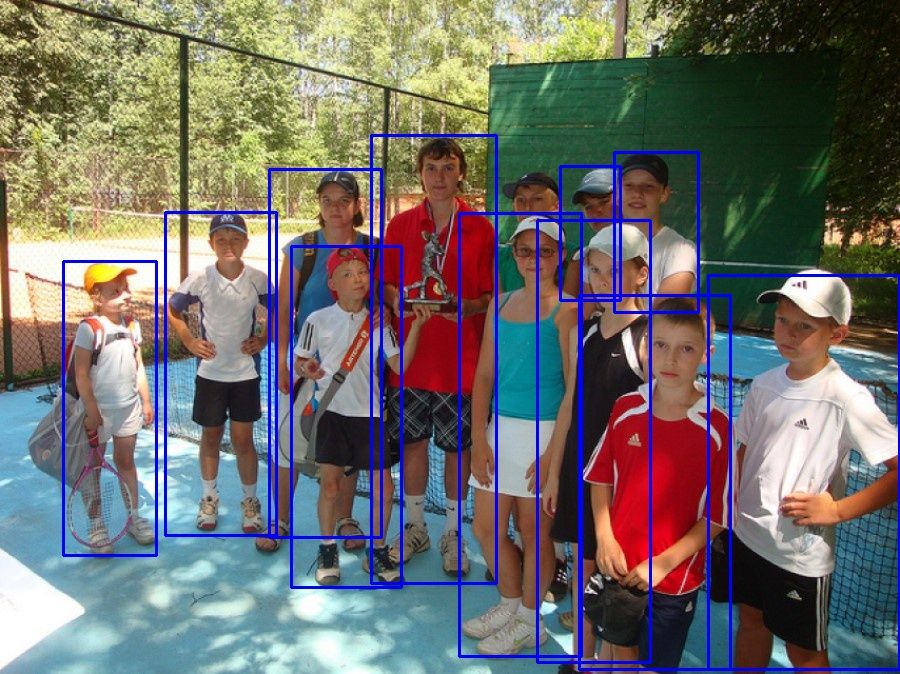
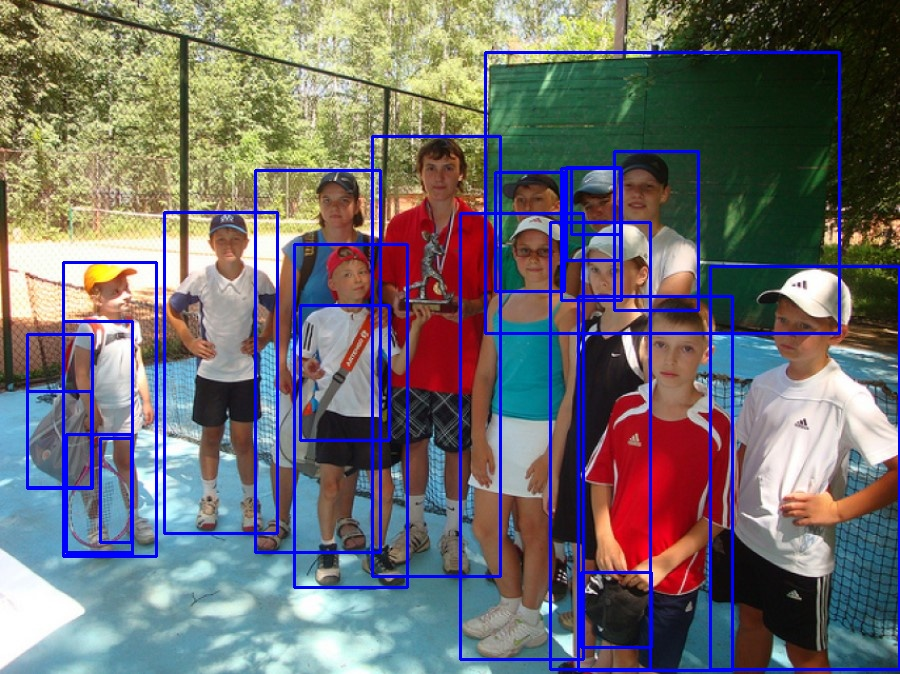
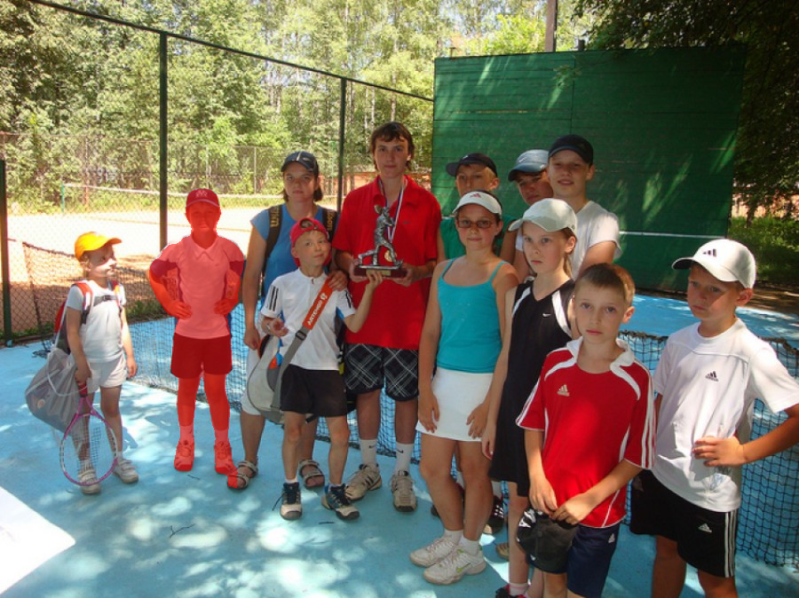

# EasyDeploy

## About The Project

This project implements several common detection and segmentation algorithms using the [EasyDeployTool](https://github.com/zz990099/EasyDeployTool) library, supporting `TensorRT`, `OnnxRuntime`, and `RKNN` inference frameworks.

### Models and Inference Frameworks Supported

- **Deployed Inference Frameworks**:
  1. TensorRT
  2. ONNX-Runtime
  3. RKNN

- **Deployed Algorithms**:
  1. YOLOv8
  2. RT-DETR
  3. MobileSAM
  4. NanoSAM

## Demo test Results

The following test results showcase the visualized reasoning outcomes of the algorithm and its inference throughput.

- Noted that, the asynchronous inference framework can significantly boost the throughput of certain algorithm models. But the latency of the inference workflow is not improved.
- The metrics in the table below represent the model's throughput, not its average latency.

### RK3588

- All results are tested on `Orangepi-5plus 16GB`

|  |  |
|:----------------------------------------:|:----------------------------------------:|
| **yolov8(int8) test result on rk3588**  | **nanosam(int8+fp16) test result on rk 3588** |

|  rk3588   |   sync   |  async   |
|:---------:|:---------:|:----------------:|
|  yolov8(int8)   |   27.20   |  39.72 (1-npu)   |
|  yolov8(int8)   |   27.20   |  136.509 (3-npu) |
|  nanosam(int8+fp16)  |   4.00    |  17.00 (2+2-npu) |

### Nvidia-GPU

- All results are tested on `NVIDIA GeForce RTX 4060-8G`.

|  |  |
|:----------------------------------------:|:----------------------------------------:|
| **yolov8(fp16) test result on nvidia-gpu**  | **rt-detr(fp32) test result on nvidia-gpu** |
|  |  |
| **mobilesam(fp32+fp16) test result on nvidia-gpu**  | **nanosam(fp16+fp16) test result on nvidia-gpu** |


|  nvidia-gpu   |   sync   |  async   |
|:---------:|:---------:|:----------------:|
|  yolov8(fp16)   |   434   |  625   |
|  rt-detr(fp32)   |   142   |  142 |
|  mobilesam(fp32+fp16)  |   38    |  48 |
|  nanosam(fp16+fp16)  |   117    |  198 |


### OnnxRuntime

- All results are tested on `RK3588 CPU`

|  |  |
|:----------------------------------------:|:----------------------------------------:|
| **yolov8(fp32) test result on rk3588-cpu**  | **rt-detr(fp32) test result on rk3588-cpu** |
|  |  |
| **mobilesam(fp32+fp32) test result on rk3588-cpu**  | **nanosam(fp32+fp32) test result on rk3588-cpu** |

|  rk3588-cpu   |   sync   |  async   |
|:---------:|:---------:|:----------------:|
|  yolov8(fp32)   |   6.3   |  6.3   |
|  rt-detr(fp32)   |   1.17   |  1.17 |
|  mobilesam(fp32+fp32)  |   0.57    |  0.57 |
|  nanosam(fp32+fp32)  |   0.87    |  0.87 |

## Getting Started

### Download Project

Clone the git repository:
```bash
git clone git@github.com:zz990099/EasyDeploy.git
cd EasyDeploy
git submodule init && git submodule update
```

### Build Enviroment

Set up the working environment using Docker:
```bash
cd EasyDeploy
bash easy_deploy_tool/docker/easy_deploy_startup.sh
# Select `jetson` -> `trt10_u2204`/`trt8_u2204`
bash easy_deploy_tool/docker/into_docker.sh
```

### Compile Codes

Inside the Docker container, compile the project. Use the `-DENABLE_*` flags to enable specific inference frameworks. Available options: `-DENABLE_TENSORRT=ON`, `-DENABLE_ORT=ON`, `-DENABLE_RKNN=ON` (compatible with each other). 
```bash
cd /workspace
mdkir build && cd build
cmake .. -DBUILD_TESTING=ON -DENABLE_TENSORRT=ON # -DENABLE_RKNN=ON
make -j
```

### Convert Model

1. Download models from [Google Drive](https://drive.google.com/drive/folders/1yVEOzo59aob_1uXwv343oeh0dTKuHT58?usp=drive_link) and place them in `/workspace/models/`.

2. Inside the Docker container, run the model conversion script:
```bash
cd /workspace
bash tools/cvt_onnx2trt.sh
# bash tools/cvt_onnx2rknn_all.sh
```

### Run Test Cases

1. Execute test cases (refer to the code for details):
```bash
cd /workspace/build
# List available test cases
ctest -N
# List available test cases
ctest
```

## References

- [ultralytics](https://github.com/ultralytics/ultralytics)
- [ultralytics-rknn](https://github.com/airockchip/ultralytics_yolov8/blob/main/RKOPT_README.md)
- [rt-detr](https://github.com/lyuwenyu/RT-DETR)
- [sam](https://github.com/facebookresearch/segment-anything)
- [mobilesam](https://github.com/ChaoningZhang/MobileSAM)
- [nanosam](https://github.com/NVIDIA-AI-IOT/nanosam)
- [EasyDeployTool](https://github.com/zz990099/EasyDeployTool)